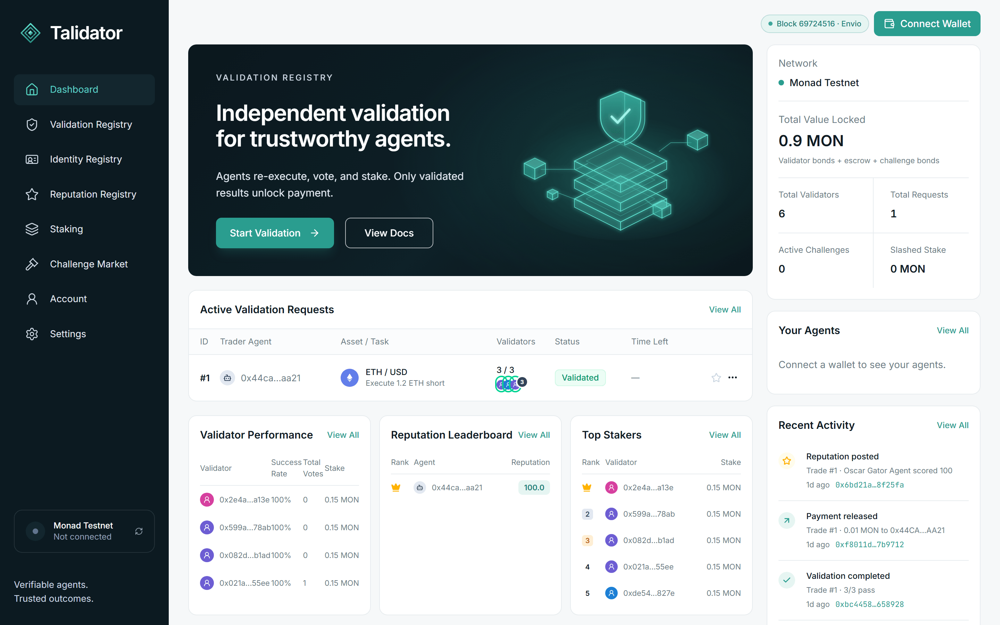

# Talidator

**An ERC-8004 Validation Registry for AI agents, live on Monad testnet.**

A trader agent claims a trade. A quorum of independent, bonded validator agents re-executes that claim against Chainlink price feeds and votes on it. Escrowed payment is released only when the result passes. Anyone can challenge a result; if the challenge is upheld, the validators who voted wrong are slashed and the challenger is paid from their stake.

**Live app:** [talidator.vercel.app](https://talidator.vercel.app)



---

## Contents

- [Technology stack](#technology-stack)
- [Architecture](#architecture)
- [Deployed contracts (Monad testnet)](#deployed-contracts-monad-testnet)
- [Smart contracts](#smart-contracts)
- [Deterministic re-execution with live prices](#deterministic-re-execution-with-live-prices)
- [Technologies and how they are used](#technologies-and-how-they-are-used)
- [Repository layout](#repository-layout)
- [Running it](#running-it)
- [Deployment](#deployment)
- [Environment variables](#environment-variables)
- [Design notes](#design-notes)

---

## Technology stack

| Layer | Technology | Version | Used for |
| --- | --- | --- | --- |
| Blockchain | **Monad testnet** (chain ID 10143) | — | Every contract, vote, bond, escrow, challenge and payout |
| Smart contracts | **Solidity**, **Foundry**, **OpenZeppelin Contracts** | 0.8.28 (EVM `cancun`), Foundry 1.6, OZ 5.6.1 | Protocol contracts, 44 tests, deploy scripts |
| Agent standard | **ERC-8004** (Trustless Agents) | — | Agent identity, validation and reputation registries |
| Market data | **Chainlink Data Feeds** | AggregatorV3 | ETH/USD, BTC/USD, LINK/USD prices that claims are verified against |
| Automation | **Chainlink Runtime Environment (CRE)** | TS SDK 1.23, CRE CLI 1.37 | Keeper workflow: finalize, release / refund escrow, post reputation |
| Agent wallets | **Privy** server wallets + policy engine | `@privy-io/node` 0.35 | Validator and challenger keys, scoped by per-role policies |
| RPC node | **Alchemy** (Monad testnet) | — | Server, agent and (via proxy) browser reads |
| Indexing | **Envio HyperIndex** + **HyperSync** | `envio` 3.14 | Indexed protocol state served over GraphQL |
| AI agent | **Qwen** via **Alibaba Cloud Model Studio** | OpenAI-compatible API | Tool-using auditor agent that re-checks results and can challenge them |
| Client-side encryption | **Mera** (passkey PRF) + WebAuthn + Web Crypto | `@category-labs/mera` 0.2 | Private notes encrypted with a passkey-derived AES-256-GCM key |
| Web framework | **Next.js** (App Router, Turbopack), **React** | Next 16.3.6, React 19.2.8 | Dashboard and API routes |
| Styling / UI | **Tailwind CSS**, **lucide-react** | Tailwind 4 | Design system and icons |
| Wallet / chain client | **wagmi**, **viem**, **TanStack Query** | wagmi 3.7.7, viem 2.56.9, Query 5 | Wallet connection, transactions, Multicall3-batched reads, SIWE |
| Authentication | **Sign-In with Ethereum** (EIP-4361) → **Firebase Authentication** custom tokens | — | Wallet-based accounts |
| Database | **Cloud Firestore** + security rules | Firebase JS 12.19, Admin 14.5 | Profiles, watchlists, alert preferences, notes, audit results |
| Web hosting | **Vercel** | — | Next.js app and serverless API routes |
| Worker hosting | **Render** (Docker) or any container host | Node 22 | Long-running validator / relayer / keeper / auditor daemon |
| Tooling | **TypeScript**, **tsx**, **ESLint**, **Vitest**, **Bun**, **Docker** | Node 22.x | Type checking, scripts, indexer tests, CRE builds, daemon image |

---

## Architecture

```
                         ┌──────────────────────────── Vercel ────────────────────────────┐
  Browser + wallet ────▶ │ Next.js 16 dashboard                                           │
  (wagmi / viem)         │  ├─ reads:  Envio GraphQL  ──(fallback)──▶  /api/rpc ─▶ Alchemy │
                         │  ├─ writes: user's wallet signs every transaction               │
                         │  ├─ /api/auth/*   SIWE → Firebase custom token                  │
                         │  ├─ /api/audit    Qwen auditor agent (tool use)  → Firestore    │
                         │  └─ /api/audit/flags  stored verdicts for the CRE workflow      │
                         └────────────────────────────────────────────────────────────────┘
                                                   │
          ┌────────────────────────────────────────▼───────────────────────────────────────┐
          │                              Monad testnet (10143)                             │
          │  IdentityRegistry · ValidatorStaking · ValidationRegistry · Escrow             │
          │  ChallengeMarket · ReputationRegistry · KeeperReceiver                         │
          │  Chainlink Data Feeds: ETH/USD · BTC/USD · LINK/USD                            │
          └───────▲──────────────────────────▲──────────────────────────────▲──────────────┘
                  │                          │                              │
   Validator daemon (Render / Docker)   Chainlink CRE workflow        Envio HyperIndex
   ├─ Privy server wallets (6 validators   (cron → EVM read →           (HyperSync → entities
   │  + challenger), policy-scoped          HTTP audit flags →            → GraphQL)
   ├─ re-executes claims vs Chainlink       signed report → Forwarder
   ├─ relays EIP-712 votes                  → KeeperReceiver)
   ├─ keeper (finalize / settle / reputation)
   └─ optional Qwen auditor → on-chain challenges
```

---

## Deployed contracts (Monad testnet)

Deployed from block `68246282`. Explorer: [testnet.monadexplorer.com](https://testnet.monadexplorer.com).

| Contract | Address |
| --- | --- |
| `IdentityRegistry` | [`0x463E1cCE88F9dA94449D7E5fcD14b13859Af36C3`](https://testnet.monadexplorer.com/address/0x463E1cCE88F9dA94449D7E5fcD14b13859Af36C3) |
| `ValidatorStaking` | [`0x2B4f0D013e25FCc0d7c9d226cB2225B8cB23DFE2`](https://testnet.monadexplorer.com/address/0x2B4f0D013e25FCc0d7c9d226cB2225B8cB23DFE2) |
| `ValidationRegistry` | [`0x7F2cf8FeABC1Cc7f2eA42371Bd912D587107E69d`](https://testnet.monadexplorer.com/address/0x7F2cf8FeABC1Cc7f2eA42371Bd912D587107E69d) |
| `Escrow` | [`0x22Ccc0840cD7d96D380E06bdd7fF8AF123E1e167`](https://testnet.monadexplorer.com/address/0x22Ccc0840cD7d96D380E06bdd7fF8AF123E1e167) |
| `ChallengeMarket` | [`0x5Ac1Ee1129B93FFfC0d2C87F7e77032988234148`](https://testnet.monadexplorer.com/address/0x5Ac1Ee1129B93FFfC0d2C87F7e77032988234148) |
| `ReputationRegistry` | [`0xbaC5330762e788D06fb4711aabe704B9E6fCf792`](https://testnet.monadexplorer.com/address/0xbaC5330762e788D06fb4711aabe704B9E6fCf792) |
| `KeeperReceiver` (Chainlink CRE) | [`0x213c61be671bd14d688f54b8Ccf224fD4680EC90`](https://testnet.monadexplorer.com/address/0x213c61be671bd14d688f54b8Ccf224fD4680EC90) |

**Protocol parameters:** minimum validator bond 0.1 MON · challenge bond 0.05 MON · voting period 30 min · challenge window 10 min · review period 5 min · unbonding period 1 day · slash 30% of bond · challenger receives 50% of slashed stake.

---

## Smart contracts

| Contract | Role |
| --- | --- |
| `IdentityRegistry` | ERC-8004 agent identities as ERC-721 tokens (trader, validator or challenger), each bound to an `agentWallet`. One identity per agent wallet |
| `ValidatorStaking` | Validators bond native MON. The ChallengeMarket slashes overturned votes. Withdrawals go through an unbonding period so stake stays slashable |
| `ValidationRegistry` | `validationRequest(validatorSet, agentId, requestURI, requestHash)`. Validators vote pass/fail with an evidence hash, directly or through a relayer with an EIP-712 signature (`submitVoteBySig`). Finalizes on a simple majority (or explicit N-of-M) or at the voting deadline |
| `Escrow` | The client locks payment against a `requestHash`. Released to the trader only on a passing result; refunded on a failing or overturned one |
| `ChallengeMarket` | Anyone can bond a challenge inside the window. A fresh quorum of bonded validators outside the original set re-checks the claim. Upheld → wrong voters slashed, challenger repaid plus a cut. Rejected → bond forfeited. An arbiter resolves when no reviewers are available or no majority forms |
| `ReputationRegistry` | Feedback is written only from *final* outcomes (a closed challenge window or a resolved challenge), never from self-reported claims |
| `KeeperReceiver` | Chainlink CRE `IReceiver`. `pendingActions()` computes due upkeep on-chain; `onReport()` accepts reports only from allow-listed forwarders and a pinned workflow owner, then executes each action independently |

Tests: `contracts/test/` — 44 Foundry tests, including the full honest / liar / collusion / challenge scenarios and the CRE report path.

---

## Deterministic re-execution with live prices

Claims travel on-chain as `data:` URIs, so validators need no off-chain storage. Each claim pins the exact **Chainlink Data Feed rounds** it traded on:

| Pair | Feed proxy on Monad testnet |
| --- | --- |
| ETH/USD | `0x5c8c8482f064049248F86D9F4aFa4B1f2F5b6d31` |
| BTC/USD | `0x12C0F44368a02081ce58a936d1C1F606BB301715` |
| LINK/USD | `0x2A9FBFbf392594c4Dd7593C8a91cdEbc02e5b884` |

Historical rounds are immutable, so every validator calling `getRoundData` sees identical prices and commits to an identical evidence hash. A claim passes only if:

1. the entry and exit rounds exist on the pair's feed (same phase, exit after entry) and their timestamps match the claim
2. both fills are within 0.1% of the round prices
3. the `momentum-v1` signal held — long only after an up-tick from the previous round, short only after a down-tick
4. the reported PnL equals the PnL recomputed from the fills

Implementation: [`src/lib/chain/market.ts`](src/lib/chain/market.ts), [`src/lib/chain/claims.ts`](src/lib/chain/claims.ts).

---

## Technologies and how they are used

### Monad
- All seven contracts run on Monad testnet; the app is pinned to chain 10143 with no mock or simulation mode.
- Fast, cheap blocks let every vote, challenge, slash and payout happen on-chain within seconds.
- Monad-specific handling:
  - agent transactions set `gas_limit` and fees explicitly, because Monad reserves `gas_limit × max_fee` up front
  - dashboard reads are batched into Multicall3 calls and JSON-RPC batches to stay within public-RPC rate limits
  - relayed votes are verified with ECDSA first and ERC-1271 as a fallback, so EIP-7702-delegated EOAs (supported on Monad) still validate

### Chainlink Data Feeds
- The source of truth for re-execution: claims reference feed rounds, and validators, the auditor agent and the dashboard all read them with `getRoundData` / `latestRoundData`.
- Honest claims are built from real recent rounds; fabricated claims (the "liar" scenario) fake the exit price and inflate PnL, and fail the exit-range and PnL checks.

### Chainlink Runtime Environment (CRE)
[`cre/talidator-keeper`](cre/talidator-keeper) is a cron-triggered CRE workflow written with the CRE TypeScript SDK. Each run:
1. **EVM read** — `KeeperReceiver.pendingActions()` at the last finalized block. The contract itself computes what is due: finalize requests past their deadline, refund failed results, release passed results once final, post reputation.
2. **HTTP** — `GET /api/audit/flags` with identical-consensus aggregation across nodes. Payouts the AI auditor has flagged as wrong are held back so a challenge can land first.
3. **EVM write** — a signed report delivered by the Chainlink Forwarder to `KeeperReceiver.onReport()`, which checks the forwarder allow-list and the workflow owner from the report metadata, then executes each action with `try/catch`.

Both Monad testnet forwarders (simulation `0xB9F7…D192` and production `0xF834…4482`) are allow-listed. The validator daemon can hand keeping to CRE with `KEEPER=off`.

### Privy
- Validators Alpha–Zeta and the challenger are **Privy server wallets**; private keys never reach the daemon host.
- Each wallet is bound to a **role policy** in Privy's policy engine, which denies anything not listed:
  - **validator** — sign EIP-712 `Vote` typed data only for this `ValidationRegistry` on chain 10143; `register`; `bond` (value-capped by `PRIVY_MAX_BOND`), `beginUnbonding`, `withdraw`; `submitReview`
  - **challenger** — `register`; `challenge` (bond-capped); `withdrawCredits`
- Votes are signed through Privy (`signTypedData`) and submitted by a relayer via `submitVoteBySig`, so validators don't spend gas to vote.
- Wallets are looked up by a stable `external_id` and policies are recovered from existing wallets, so restarts on ephemeral hosts reuse the same identities.

Implementation: [`contracts/agents/lib/privy.ts`](contracts/agents/lib/privy.ts).

### Alchemy
- Monad testnet node for server routes, the validator daemon and the agent CLIs (`https://monad-testnet.g.alchemy.com/v2/<key>`).
- Browsers read through [`/api/rpc`](src/app/api/rpc/route.ts), a read-only JSON-RPC proxy: it forwards an allow-list of read methods (including batches), rejects writes and signing methods, and keeps `ALCHEMY_API_KEY` server-side. All writes are signed by the user's own wallet.
- When no indexer is configured, event history is scanned incrementally through Alchemy in `NEXT_PUBLIC_LOG_CHUNK_SIZE`-block chunks.

### Envio HyperIndex
- [`indexer/`](indexer) indexes all six protocol contracts on Monad testnet from block 68246282 via HyperSync.
- Handlers derive ready-to-render entities: `Agent`, `Validator`, `ValidationRequest`, `Vote`, `EscrowDeal`, `Challenge`, `Review`, `Slash`, `ProtocolEvent`, `ProtocolStats` — including validator agreement rates (re-scored when a challenge overturns a result), slash history, reputation averages, claim fields parsed from `data:` URIs, and an activity feed keyed by the addresses involved.
- The dashboard loads everything with one GraphQL query ([`src/lib/chain/envio.ts`](src/lib/chain/envio.ts)); the sync badge shows **Envio**. If the indexer is unreachable, [`LiveSync`](src/components/live-sync.tsx) falls back to RPC for that poll and the badge shows **RPC**.
- Tests: [`indexer/src/indexer.test.ts`](indexer/src/indexer.test.ts) (Vitest) replays the full scenario set and checks every derived value.

### Qwen (Alibaba Cloud Model Studio)
An autonomous **auditor agent** using the OpenAI-compatible Chat Completions API with function calling ([`src/lib/agent/auditor.ts`](src/lib/agent/auditor.ts)). The model is set by `QWEN_MODEL` (default `qwen3.8-max`) and shown in the UI.

| Tool | What it gives the agent |
| --- | --- |
| `get_request` | Votes, threshold, outcome, deadlines, challenge state and remaining window |
| `decode_claim` | The trader's claim from the request URI |
| `reexecute_claim` | An independent re-execution against Chainlink, with each check and the on-chain rounds |
| `get_price_rounds` | Raw Chainlink feed rounds |
| `get_validator_record` | Bond, slashing history and voting track record |
| `get_agent_reputation` | The trader's ERC-8004 identity and reputation |

The agent plans, calls tools for up to 10 turns, and returns structured JSON: `verdict`, `recommendedAction`, `confidence`, `summary`, `findings`. It is used in three places:
1. **Dashboard** — the request drawer's *AI auditor* panel (`/api/audit`) shows the verdict, findings and full tool trace; results are cached in Firestore.
2. **Validator daemon** — with `AUDITOR=on`, finalized results the agent is confident are wrong (`AUDITOR_MIN_CONFIDENCE`) are challenged on-chain from the Privy challenger wallet.
3. **Chainlink CRE** — `/api/audit/flags` exposes flagged results so the keeper holds their payouts.

### Mera
- **Encrypt with passkey** (Account page) creates a WebAuthn passkey and evaluates its PRF extension under a Talidator-specific salt, `sha256("talidator.notes.v1")` — an isolated key namespace unrelated to any wallet key.
- HKDF derives a **non-extractable AES-256-GCM key** that exists only in browser memory.
- Note bodies are encrypted client-side; Firestore stores only `{ iv, ct }`. The same synced passkey on another device re-derives the key, so nothing secret is ever stored.

Implementation: [`src/lib/account/vault.ts`](src/lib/account/vault.ts).

### Firebase (Authentication + Cloud Firestore)
- **Sign-In with Ethereum:** [`/api/auth/nonce`](src/app/api/auth/nonce/route.ts) issues a single-use nonce stored in Firestore; the user signs an EIP-4361 message (no transaction); [`/api/auth/verify`](src/app/api/auth/verify/route.ts) checks domain, chain ID and nonce, verifies the signature against Monad (EOAs, ERC-1271 smart accounts, EIP-7702 wallets) and returns a Firebase custom token whose `uid` is the lowercase wallet address.
- **Per-user data** under `users/{wallet}`: profile and alert preferences, a `watchlist/` of starred agents and requests, and `notes/` (optionally Mera-encrypted). [`firestore.rules`](firestore.rules) restricts every document to its owner; nonces and audits are server-only.
- **My dashboard** shows the requests a user made, paid for, challenged or validated, their watchlist and activity feed, and an alerts bell filtered by their preferences.
- Without Firebase configured, sign-in is hidden and the app runs as a public on-chain dashboard.

### Next.js, wagmi and viem
- Next.js 16 App Router pages for the dashboard, validation, identity, reputation, staking, challenge market, account and settings; route handlers for auth, RPC proxy and audits.
- wagmi + viem for wallet connection and transactions ([`src/lib/actions.ts`](src/lib/actions.ts)): start a validation (escrow `deposit` + `validationRequest`), challenge, register an agent, bond / unbond / withdraw, release / refund.
- [`LiveSync`](src/components/live-sync.tsx) polls every 4 s; contract views are batched through Multicall3.

### Vercel and Render
- **Vercel** hosts the Next.js app and its serverless API routes.
- **Render** (or any Docker host) runs the long-running validator daemon from [`contracts/Dockerfile`](contracts/Dockerfile). When `PORT` is set it serves a `/health` JSON endpoint, and the app pings it (`NEXT_PUBLIC_DAEMON_URL`) whenever a validation or challenge is submitted, waking a sleeping instance.

---

## Repository layout

```
talidator/
├── src/                     Next.js 16 app (App Router, Tailwind 4, wagmi 3 / viem)
│   ├── app/                 pages + API routes (auth, rpc proxy, audit, audit flags)
│   ├── components/          dashboard UI
│   ├── lib/chain/           ABIs, deployments, Chainlink market data + re-execution, Envio & Alchemy clients
│   ├── lib/agent/           Qwen auditor agent (shared by /api/audit and the daemon)
│   ├── lib/account/         Firebase accounts, Mera passkey vault
│   └── lib/firebase/        client + Admin SDK setup
├── contracts/               Foundry workspace
│   ├── src/                 7 Solidity contracts
│   ├── test/                44 Foundry tests
│   ├── script/              Deploy.s.sol, DeployKeeper.s.sol
│   ├── agents/              validator daemon, scenario runner, single-request CLI (Privy wallets)
│   ├── scripts/             deploy + ABI export helpers
│   └── Dockerfile           daemon image
├── indexer/                 Envio HyperIndex (config.yaml, schema.graphql, handlers, tests)
├── cre/                     Chainlink CRE project (talidator-keeper workflow)
├── public/brand/            logo, app icon and wordmarks
└── docs/                    screenshots
```

---

## Running it

**Prerequisites:** Node 22, Foundry (`forge`; the npm scripts also find it in `~/.foundry/bin`), a wallet with Monad testnet MON. Optional: Bun ≥ 1.2.21 and the CRE CLI for the keeper workflow; WSL for the Envio CLI on Windows.

### 1. Contracts and agents (`contracts/`)
```bash
cp .env.example .env        # set PRIVATE_KEY, PRIVY_APP_ID, PRIVY_APP_SECRET, ALCHEMY_API_KEY
npm install
npm test                    # 44 Foundry tests
npm run deploy:monad        # deploy + export ABIs/addresses to the app (skip to use the live deployment)
npm run deploy:keeper       # KeeperReceiver for Chainlink CRE
npm run validator:monad     # validator / relayer / keeper / auditor daemon
```
Other agent commands:
```bash
npm run demo:monad                                          # full scripted scenario with tx hashes
npx tsx agents/request.ts --network monadTestnet [--liar]   # submit a single claim
```
On first start the daemon provisions the Privy wallets, funds them from `PRIVATE_KEY`, registers their ERC-8004 identities and bonds them.

> Never use anvil's well-known dev keys on Monad: their addresses carry EIP-7702 sweeper delegations there.

### 2. Web app (repo root)
```bash
cp .env.example .env.local  # fill in the values (see Environment variables)
npm install
npm run dev
```

### 3. Indexer (`indexer/`, Linux / WSL)
```bash
pnpm install && pnpm codegen && pnpm test
pnpm dev                    # local run (Docker)
```

### 4. Chainlink CRE keeper (`cre/talidator-keeper/`)
```bash
bun install
npm run simulate             # dry run against Monad testnet
npm run simulate:broadcast   # executes the keeper report on-chain via the simulation forwarder
```
`CRE_ETH_PRIVATE_KEY` in `cre/.env` signs simulated writes and determines the workflow owner.

---

## Deployment

### Web app → Vercel
1. Import the repository (framework preset: Next.js; no `vercel.json` needed).
2. Node.js version **22.x** (also pinned in `package.json` `engines`).
3. Add the variables from [`.env.example`](.env.example); set `SIWE_DOMAIN` to the production host (e.g. `talidator.vercel.app`).
4. Deploy. `NEXT_PUBLIC_*` values are inlined at build time — redeploy after changing them.
5. Publish Firestore rules: `npx firebase-tools deploy --only firestore:rules --project <id>`.

### Validator daemon → Render
1. **New → Web Service**, runtime **Docker**, Dockerfile path `contracts/Dockerfile`, build context `.` (repo root), health check path `/health`.
2. Environment: `PRIVATE_KEY`, `PRIVY_APP_ID`, `PRIVY_APP_SECRET`, `ALCHEMY_API_KEY`, and optionally `KEEPER`, `AUDITOR`, `QWEN_API_KEY`, `QWEN_MODEL`, `POLL_MS`.
3. Set `NEXT_PUBLIC_DAEMON_URL` on Vercel to the service URL so the app wakes it on demand.

Local equivalent:
```bash
docker build -f contracts/Dockerfile -t talidator-daemon .
docker run --env-file contracts/.env -e PORT=8080 -p 8080:8080 talidator-daemon
```

### Indexer → Envio hosted service
Create an indexer at [envio.dev/app](https://envio.dev/app) from this repository with root directory `indexer`, then set `NEXT_PUBLIC_ENVIO_GRAPHQL_URL` to its GraphQL endpoint.

---

## Environment variables

### Web app (`.env.local` / Vercel)
| Variable | Purpose |
| --- | --- |
| `NEXT_PUBLIC_IDENTITY_REGISTRY` … `NEXT_PUBLIC_REPUTATION_REGISTRY` | The six protocol contract addresses |
| `NEXT_PUBLIC_DEPLOY_BLOCK` | Block to index history from |
| `NEXT_PUBLIC_MONAD_RPC_URL` | Optional explicit RPC override |
| `ALCHEMY_API_KEY`, `NEXT_PUBLIC_USE_ALCHEMY_PROXY` | Alchemy node; browsers read via `/api/rpc` |
| `NEXT_PUBLIC_LOG_CHUNK_SIZE` | `eth_getLogs` range for the RPC fallback (10 on Alchemy's free tier, 100 on Monad's public RPC) |
| `NEXT_PUBLIC_ENVIO_GRAPHQL_URL` | Envio GraphQL endpoint |
| `QWEN_API_KEY`, `QWEN_MODEL`, `QWEN_BASE_URL` | Qwen auditor agent (Model Studio, OpenAI-compatible) |
| `AUDIT_FLAG_MIN_CONFIDENCE` | Confidence threshold for `/api/audit/flags` (default 0.8) |
| `NEXT_PUBLIC_FIREBASE_*` | Firebase web config |
| `FIREBASE_PROJECT_ID`, `FIREBASE_CLIENT_EMAIL`, `FIREBASE_PRIVATE_KEY` | Firebase Admin service account |
| `SIWE_DOMAIN` | Accepted sign-in host(s), comma-separated |
| `NEXT_PUBLIC_DAEMON_URL` | Validator daemon URL to wake on demand |

### Agents / daemon (`contracts/.env`)
| Variable | Purpose |
| --- | --- |
| `PRIVATE_KEY` | Operator: deployer, relayer, keeper, arbiter, agent funder |
| `PRIVY_APP_ID`, `PRIVY_APP_SECRET` | Privy server wallets for validators and the challenger |
| `PRIVY_MAX_BOND` | Per-transaction value cap in the Privy policies (MON) |
| `MNEMONIC` | Trader agents for the scripted scenario (and validators when Privy isn't configured) |
| `ALCHEMY_API_KEY` / `RPC_URL` | Node for the agents |
| `KEEPER` | `off` hands keeping to Chainlink CRE |
| `AUDITOR`, `AUDITOR_MIN_CONFIDENCE`, `QWEN_*` | Autonomous Qwen auditor and on-chain challenges |
| `COLLUDING` | Validators to run dishonestly (collusion scenario) |
| `POLL_MS`, `AGENT_GAS_BUFFER` | Polling interval; MON kept in each agent wallet for gas |
| `CRE_FORWARDERS` | Forwarders allow-listed by `KeeperReceiver` at deploy |

---

## Design notes

- **Collusion is punished, not prevented.** A colluding quorum still finalizes; the challenge market makes collusion costly after the fact.
- **Payment timing.** `Escrow.release()` is callable once a quorum passes, but the bundled keepers (daemon and CRE) only release after the challenge window closes, and refund failures immediately.
- **Reviewer selection** for challenges is a pseudo-random walk over bonded validators; a production deployment would use a VRF.
- **Sybil resistance** rests on the bond size: validator registration is permissionless for anyone with an identity and the minimum bond.
- **Feed cadence.** Chainlink feeds update on deviation or heartbeat, so a claim's entry and exit rounds can be minutes or hours apart rather than fixed intervals.
